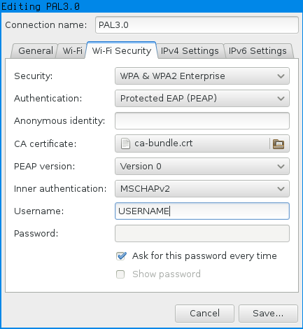


This tutorial has been copied verbaitim from the old PLUG wiki, and its contents may be out of date.
Please submit a pull request with any updates!


## Connect with Network Manager

Click on the wireless icon in your tray area. Select "Connect to Hidden Wi-Fi Network" or choose PAL3.0 and enter these settings.

- Network Name: "PAL3.0"
- Wireless Security: WPA & WPA2 Enterprise
- Authentication: Protected EAP (PEAP)
- Key Type (if present): TKIP
- Phase2 Type / Inner Authentication: MSCHAPV2
- Identity / Username: Your Purdue Login
- Password: Your Purdue Password
- Anonymous Identity: (leave blank)
- Client Certificate File (if present): (None)
- CA Certificate File: /etc/ssl/certs/AddTrust_External_Root.pem or /etc/ssl/certs/AddTrust_External_CA_Root.pem
- Private Key File: (None)
- Private Key Password: (leave blank)
- 'PEAP' version: choose 'Version 0'.



Click save.

## Connect with netctl

These instructions will allow you to connect to PAL3.0 using netctl, the default network manager in Arch Linux

Edit the file `/etc/netctl/PAL3` to resemble the following (fill in your own information for interface, identity, and password)

```
Description='PAL3.0-profile'
 Interface=wlan0
 Connection=wireless
 Security=wpa-configsection
 IP=dhcp
 WPAConfigSection=(
  'ssid="PAL3.0"'
  'proto=RSN WPA'
  'key_mgmt=WPA-EAP'
  'auth_alg=OPEN'
  'eap=PEAP'
  'identity="username"'
  'password="password"'
 )
```

After doing this, you should be able to connect to PAL by running netctl switch-to PAL3
